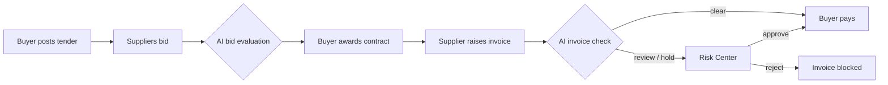
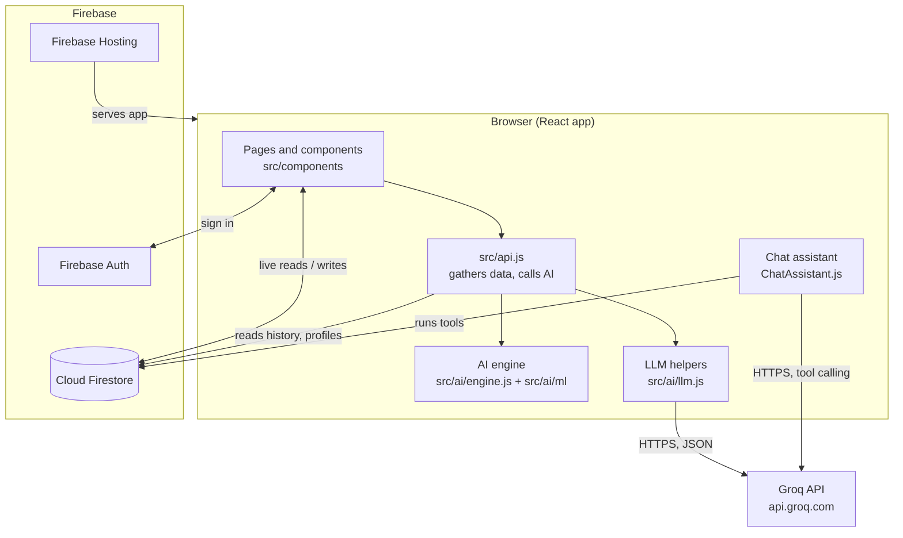
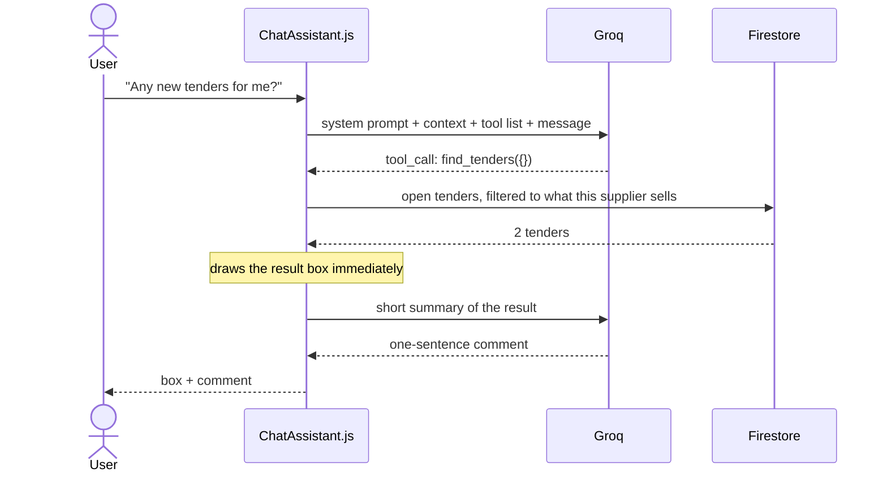
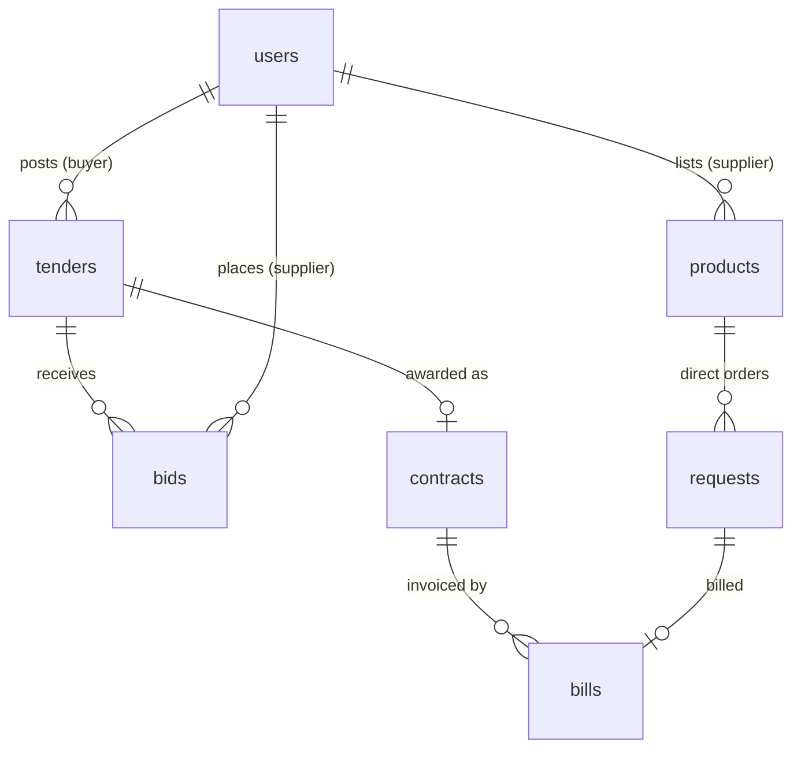

# Tether

**AI-powered prevention of procurement leakage.**

Tether is a B2B procurement platform. Buyer companies post what they need as **tenders**, suppliers compete
with **bids**, the buyer **awards a contract**, and every **invoice** the supplier sends is checked by AI
against that contract *before* any money is paid.

**Live demo:** https://tether-40505.web.app

> Final-year project, Department of Computer Science & Engineering, Amrita School of Computing, Chennai.
> Team: Kanikuntla Vyshnavi (CH.SC.U4AIE23025), Madhumitha K (CH.SC.U4AIE23027), Madhunala Himanshu (CH.SC.U4AIE23028).
> Faculty: Bharati Mohan.

---

## Contents

1. [The problem](#1-the-problem)
2. [What Tether does](#2-what-tether-does)
3. [Architecture](#3-architecture)
4. [How the parts communicate](#4-how-the-parts-communicate)
5. [The AI, module by module](#5-the-ai-module-by-module)
6. [Data model](#6-data-model)
7. [Project structure](#7-project-structure)
8. [Running locally](#8-running-locally)
9. [Deploying](#9-deploying)
10. [Demo script](#10-demo-script)
11. [Security notes and limitations](#11-security-notes-and-limitations)
12. [Future work](#12-future-work)

---

## 1. The problem

Companies lose money in procurement in ways that ordinary accounting software does not catch:

| Leak | Example |
|---|---|
| Duplicate payments | The same invoice is sent twice with a slightly different number or date. |
| Contract leakage | An invoice charges more per unit, more units, or extra fees the contract never allowed. |
| Rigged bidding | "Competing" suppliers are secretly the same owner, or copy each other's proposals. |
| Conflicts of interest | A supplier shares an address or bank account with someone at the buying company. |

Traditional audits are periodic, so these are usually found **after** the money has gone. Tether checks
every transaction **before** payment and explains each warning in plain language.

## 2. What Tether does

There are two roles, chosen at registration:

| | Buyer (`consumer`) | Supplier (`supplier`) |
|---|---|---|
| **Tenders** | Describes a need in one sentence; AI drafts the full tender | Sees open tenders for the products it sells |
| **Bids** | Sees all bids ranked by AI, with warnings | Gets AI price guidance, submits one bid |
| **Contracts** | Awards the best bid, which creates a contract | Raises invoices against won contracts |
| **Invoices** | Pays invoices; flagged ones are held for review | Sees the AI check result right after sending |
| **Risk Center** | Reviews flagged invoices, sees leakage stopped | — |
| **Assistant** | Chat panel: invoices, tenders, AI checks | Chat panel focused only on what it sells |



## 3. Architecture

Tether is a single-page React app. There is **no custom backend server**:

- **Firebase Authentication** handles sign-up and sign-in.
- **Cloud Firestore** stores all data and pushes live updates to the browser.
- The **AI engine** (rules, statistics and machine learning) runs **inside the browser** in `src/ai/`.
- The **language model** (Groq, model `qwen/qwen3.8-27b`) is called directly over HTTPS for anything that
  needs natural language: drafting, explanations, reading contract terms and the chat assistant.
- **Firebase Hosting** serves the built app.



**Why this split?** Every decision that blocks a payment is made by the deterministic engine: rules,
statistics and the Isolation Forest. It works offline, gives the same answer every time and can be
tested. The language model only *explains* and *assists*. If it is unreachable, every check still runs and
falls back to template explanations.

## 4. How the parts communicate

### 4.1 Overview of every channel

| From | To | How | Used for |
|---|---|---|---|
| React pages | Firebase Auth | Firebase JS SDK | Register, sign in, session |
| React pages | Firestore | SDK `onSnapshot` (live) and `getDocs` | Lists update instantly when another user acts |
| React pages | Firestore | SDK `addDoc` / `updateDoc` / `writeBatch` | Create tenders, bids, contracts, invoices; award; approve |
| `src/api.js` | `src/ai/engine.js` | Plain function call | Bid and invoice analysis |
| `src/ai/llm.js` | Groq | `fetch` POST `/openai/v1/chat/completions` | Drafting, explanations, term extraction, briefing |
| `ChatAssistant.js` | Groq | `fetch` with `tools` (function calling) | The assistant chooses which action to run |
| `ChatAssistant.js` | Firestore | SDK, inside the tool functions | The assistant's lookups and actions |

Users never talk to each other directly. **Firestore is the meeting point.** When a supplier submits a bid,
it is written to the `bids` collection, and the buyer's open tender page receives it through its live
`onSnapshot` listener without a refresh.

### 4.2 From tender to paid invoice

```mermaid
sequenceDiagram
    autonumber
    actor Buyer
    actor Supplier
    participant App as React app
    participant AI as AI engine (browser)
    participant G as Groq LLM
    participant DB as Firestore

    Buyer->>App: "200 tons of steel by 15 Dec, max ₹600/ton"
    App->>G: draftTender(sentence)
    G-->>App: title, quantity, price, dates, terms (JSON)
    Buyer->>App: review and publish
    App->>DB: add tenders/{id} (status: open)

    DB-->>Supplier: live update: new open tender
    Supplier->>App: open tender
    App->>DB: read past contract prices
    App->>G: bidGuidance(tender, prices)
    G-->>App: tip; range computed locally
    Supplier->>App: submit bid
    App->>DB: add bids/{id}, tender.bidCount +1

    DB-->>Buyer: live update: new bid
    App->>DB: read supplier profiles, history, market prices
    App->>AI: analyzeBids(...)
    AI-->>App: risk per bid, flags, recommended bid
    App->>G: explainBids(result)
    App->>DB: save tender.aiAnalysis
    Buyer->>App: Award contract
    App->>G: extractTerms(contract text)
    G-->>App: { extraChargesAllowed, paymentTermsDays, ... }
    App->>DB: add contracts/{id}; batch: tender awarded, bids awarded/rejected

    Supplier->>App: Raise invoice (qty, price, extras)
    App->>DB: read buyer's past invoices and both profiles
    App->>AI: analyzeInvoice(contract, invoice, history)
    AI-->>App: riskScore, level, flags, estimatedLeakage
    App->>G: explainInvoice(result)
    App->>DB: add bills/{id} with analysis + reviewStatus

    alt level = clear
        Buyer->>App: Pay
        App->>DB: bill.status = paid
    else level = review or hold
        DB-->>Buyer: Risk Center badge count
        Buyer->>App: Approve or Reject
        App->>DB: bill.reviewStatus = approved / rejected
    end
```

### 4.3 How the chat assistant works

The assistant uses **function calling**. The model never touches the database itself: it asks the app to
run a named tool, the app runs it with the signed-in user's permissions, and the result is drawn as a box
in the chat.



| Role | Tools |
|---|---|
| Buyer | `list_my_tenders`, `list_bills`, `risk_summary`, `pay_bill`, `verify_payment`, `search_products`, `set_company_limit`, `navigate_to` |
| Supplier | `find_tenders`, `my_bids`, `my_contracts`, `list_requests`, `list_products`, `send_bill`, `navigate_to` |

**Supplier focus.** When a supplier opens the assistant, Tether works out what they sell (their catalogue
plus products they hold contracts for). Tender searches, suggestions and the system prompt are limited to
those products, so a steel supplier is not shown laptop tenders.

### 4.4 Example AI request and response

Every LLM call is a standard OpenAI-compatible request:

```http
POST https://api.groq.com/openai/v1/chat/completions
Authorization: Bearer <REACT_APP_GROQ_API_KEY>
Content-Type: application/json

{
  "model": "qwen/qwen3.8-27b",
  "messages": [
    { "role": "system", "content": "You extract procurement contract terms. Reply with JSON only ..." },
    { "role": "user",   "content": "Price inclusive of all charges; no extra charges. Payment within 30 days." }
  ],
  "response_format": { "type": "json_object" },
  "temperature": 0.2
}
```

```json
{
  "extraChargesAllowed": false,
  "paymentTermsDays": 30,
  "extraChargesClause": "Price inclusive of all charges; no extra charges.",
  "summary": "The price includes everything and payment is due within 30 days."
}
```

## 5. The AI, module by module

These map to the modules in the project proposal.

### Module 1: Transaction validation (rules)
`src/ai/engine.js → analyzeInvoice`

| Check | Flag | Example evidence |
|---|---|---|
| Unit price above contract | `price_exceeded` | `{ expected: 500, actual: 650, overcharge: 3000 }` |
| Total quantity above contract | `quantity_exceeded` | `{ expected: 100, actual: 110, excess: 10 }` |
| Extra charges the contract forbids | `extra_charges_not_allowed` | `{ expected: 0, actual: 800 }` |
| Extra charges above the contract cap | `extra_charges_exceeded` | |
| Extra charges the contract is unclear about | `extra_charges_unverified` | |

### Module 2: Contract term repository (LLM extraction)
`src/ai/llm.js → extractTerms`

At award time the free-text terms are turned into structured fields (`extraChargesAllowed`,
`maxExtraCharges`, `paymentTermsDays`, …) and stored on the contract. Module 1 then enforces them. A regex
fallback covers common phrases when the LLM is unavailable.

### Module 3: Duplicate detection (content similarity)
Instead of matching invoice IDs, each new invoice is compared with the same supplier's earlier invoices
to the same buyer:

```
similarity = 0.35 × amount closeness + 0.25 × quantity match
           + 0.25 × description similarity (TF-IDF cosine) + 0.15 × time proximity (30-day window)
```

At 70% or more the invoice is flagged for review, and at 85% or more it is treated as high risk. Repeat
orders are flagged, not blocked outright.

### Module 4: Relationship analysis (entity resolution)
`sharedIdentifiers()` compares two company profiles on bank account, GSTIN, phone, address (TF-IDF
similarity), company email domain and directors. It is used to detect:

- `buyer_conflict`: a supplier linked to the buyer's own company (possible shell company)
- `linked_bidders`: two bidders on the same tender that share an owner

### Module 5: Explainable flagging
Every flag has the same shape:

```js
{ type: 'price_exceeded', severity: 'high', title: 'Price higher than contract',
  detail: 'Billed ₹650.00 per ton, but the contract price is ₹500.00. Overcharge: ₹3000.00.',
  evidence: { expected: 500, actual: 650, overcharge: 3000 } }
```

Each flag type also has a plain-English explanation behind an ⓘ button (`src/constants/glossary.js`).

### Machine learning and statistics

| Technique | File | Used for |
|---|---|---|
| **Isolation Forest** (implemented from scratch, seeded so results are reproducible) | `src/ai/ml/isolationForest.js` | Scores how unusual an invoice is against the buyer's history (amount, price ratio, extra-charge share, quantity). Used once there are 10 or more past invoices. |
| **Robust z-score** (median absolute deviation) | `src/ai/ml/stats.js` | Abnormally low or high bid prices compared with past contract prices; small-history anomaly fallback |
| **Coefficient of variation** | `src/ai/ml/stats.js` | Detects bids priced suspiciously close together (possible price-fixing) |
| **TF-IDF + cosine similarity** | `src/ai/ml/text.js` | Copied bid proposals, duplicate invoice descriptions, address matching |

### Bid ranking

```
value score = 55% price (cheapest = best) + 20% delivery speed + 25% (1 − risk)
```

Bids on hold are never recommended.

### Risk score and decision

Each flag adds to the score (high 40, medium 20, low 8, plus the anomaly score), capped at 100:

| Score | Decision | Effect |
|---|---|---|
| 0–24 | **clear** | Auto-approved, can be paid |
| 25–59 | **review** | Shown in the Risk Center |
| 60–100 | **hold** | Payment blocked until the buyer approves |

### Assistive AI (LLM)

| Feature | Function | What it does |
|---|---|---|
| Tender drafting | `draftTender` | One sentence becomes a full tender form |
| Price guidance | `bidGuidance` | Range from past contracts (25th–75th percentile) plus a proposal tip |
| Bid explanation | `explainBids` | Which bid to pick and why |
| Invoice explanation | `explainInvoice` | Why an invoice was flagged and what to do |
| Home briefing | `briefing` | Two-sentence status and the next step |

## 6. Data model

All data lives in Cloud Firestore.



| Collection | Key fields |
|---|---|
| `users/{uid}` | `role` (`consumer` / `supplier`), `companyName`, `email`, `description`, optional `address`, `phone`, `gstin`, `bankAccount`, `keyPeople` |
| `tenders` | `buyerId`, `title`, `productName`, `quantity`, `unit`, `maxUnitPrice`, `bidDeadline`, `deliveryBy`, `terms`, `status` (`open`/`closed`/`awarded`), `bidCount`, `aiAnalysis`, `contractId` |
| `bids` | `tenderId`, `buyerId`, `supplierId`, `unitPrice`, `quantity`, `deliveryDays`, `proposal`, `status` (`submitted`/`awarded`/`rejected`) |
| `contracts` | `tenderId`, `bidId`, `buyerId`, `supplierId`, `agreedUnitPrice`, `maxQuantity`, `quantityInvoiced`, `amountInvoiced`, `terms`, `extractedTerms`, `status` |
| `bills` | `contractId` or `requestId`, `supplierId`, `consumerId`, `unitCost`, `quantityRequested`, `extraCharges`, `amount`, `status` (`unpaid`/`paid`/`rejected`), `analysis`, `reviewStatus` (`auto_cleared`/`pending_review`/`approved`/`rejected`) |
| `products`, `requests`, `ratings`, `limits` | Direct catalogue purchasing (the original flow, still available for small orders) |

## 7. Project structure

```
tether/
├── public/                    static HTML shell
├── src/
│   ├── ai/                    AI engine (runs in the browser)
│   │   ├── engine.js          analyzeBids, analyzeInvoice, relationship checks, scoring
│   │   ├── llm.js             Groq calls: drafting, explanations, term extraction, briefing
│   │   ├── engine.test.js     8 unit tests
│   │   └── ml/
│   │       ├── isolationForest.js
│   │       ├── stats.js       median, robust z-score, coefficient of variation
│   │       └── text.js        tokenizer, TF-IDF, cosine similarity
│   ├── api.js                 reads Firestore data the engine needs, runs the engine and LLM
│   ├── components/
│   │   ├── Home.js            AI briefing, key numbers, setup checklist
│   │   ├── Tenders.js         tender list + AI drafting composer
│   │   ├── TenderDetail.js    bids, AI evaluation, price guidance, award
│   │   ├── Contracts.js       contracts and invoicing (with AI check)
│   │   ├── RiskCenter.js      review queue, insights, supplier risk
│   │   ├── MyOrders.js        invoices list
│   │   ├── Checkout.js        payment, blocked while on hold
│   │   ├── ChatAssistant.js   assistant with function calling and result boxes
│   │   ├── Guide.js           shared UI: PageHeader, InfoTip (ⓘ), RiskBadge, FlagList, AiTag
│   │   ├── GettingStarted.js  first-use checklist
│   │   └── …                  auth, profile, catalogue and legacy pages
│   ├── constants/glossary.js  plain-language explanations for the ⓘ buttons
│   ├── context/               AuthContext (user + role), ThemeContext (light/dark)
│   ├── firebase.js            Firebase app, Auth and Firestore
│   └── index.css              design system (tokens, components, dark mode)
├── firestore.rules            security rules (see section 11)
├── firebase.json              hosting config (SPA rewrite, caching)
└── .firebaserc                Firebase project: tether-40505
```

## 8. Running locally

**Requirements:** Node.js 18 or newer and a Groq API key (free at https://console.groq.com).

```bash
git clone https://github.com/himanshu2005-tech/tether.git
cd tether
npm install
```

Create `.env` in the project root (it is git-ignored):

```
REACT_APP_GROQ_API_KEY=your_groq_key
# optional
REACT_APP_GROQ_MODEL=qwen/qwen3.8-27b
```

```bash
npm start          # http://localhost:3000
npm run test:ai    # engine unit tests
npm run build      # production build in build/
```

Without a Groq key the app still works and every check runs. Only drafting, explanations and the
assistant fall back to simple rule-based text.

## 9. Deploying

The app is hosted on Firebase Hosting (project `tether-40505`).

```bash
npm install -g firebase-tools
firebase login
npm run build
firebase deploy --only hosting
```

`firebase.json` rewrites every path to `index.html` so links like `/tenders/abc` work on refresh, caches
hashed static files for a year, and never caches `index.html`, so new releases appear immediately.

## 10. Demo script

About five minutes. It shows every type of detection.

1. Register **Buyer Co** as a buyer, and **Alpha**, **Beta** and **Gamma** as suppliers.
   In Profile → Business details, give Alpha and Beta the **same bank account**.
2. As Buyer Co, open **Tenders → New tender** and type:
   *"100 tons of steel beams by 15 December, max ₹600 a ton, price inclusive of all charges, pay in 30 days."*
   Click **Draft with AI**, check the form, then publish.
3. Bid as each supplier: Alpha ₹520 and Beta ₹540 with almost the same proposal text; Gamma ₹510 with its
   own wording. Each supplier sees AI price guidance before bidding.
4. As Buyer Co, open the tender. The AI flags Alpha and Beta as **linked bidders** with **copied
   proposals** and recommends Gamma. Award the contract to Gamma.
5. As Gamma, **Contracts → Raise invoice** for 40 tons at the contract price: **cleared**.
6. Raise the same invoice again: **possible duplicate**. Raise 10 tons at ₹650 with ₹800 extra charges:
   **price above contract** + **extra charges not allowed** → **payment on hold**.
7. As Buyer Co, open the **Risk Center** to see the review queue, the leakage stopped and supplier risk.
   Try to pay the held invoice: it is blocked until approved.
8. Open the assistant (bottom right) and ask *"Which invoices need my attention?"*

## 11. Security notes and limitations

- **The Groq key is visible in the browser.** Because the app calls Groq directly, the key is bundled
  into the JavaScript served to every visitor. This is acceptable for a demo; for production, move
  `src/ai/llm.js` and the assistant's model calls into a Firebase Cloud Function and use a fresh key.
- **Firestore rules.** `firestore.rules` restricts each collection to the right parties (for example, only
  the buyer can approve or reject an invoice, so a supplier cannot clear its own flagged invoice).
  Deploy them with `firebase deploy --only firestore:rules`. Until they are deployed, any signed-in user can
  write any document.
- **Analysis runs on the client.** The data sent to the engine is gathered in the browser, so a determined
  user could tamper with it. A production version should run the engine in a Cloud Function using the
  Firebase Admin SDK.
- **Profile visibility.** Business details (including bank account numbers used for matching) are
  readable by signed-in users so the relationship check can compare them. Moving the analysis server-side
  would remove this.
- **Cold start.** The Isolation Forest needs about 10 past invoices per buyer; before that, a robust
  z-score is used.

## 12. Future work

- Graph database (Neo4j) for multi-hop relationship analysis (employee → address → vendor → bank account)
- Contract PDF upload with LLM extraction, instead of typed terms
- Server-side analysis in Cloud Functions with the Admin SDK
- Learning the risk weights from reviewed outcomes (approved vs rejected) instead of fixed weights
- Email or push notifications when an invoice is held

---

Built with React, Firebase (Auth, Firestore, Hosting) and Groq.
