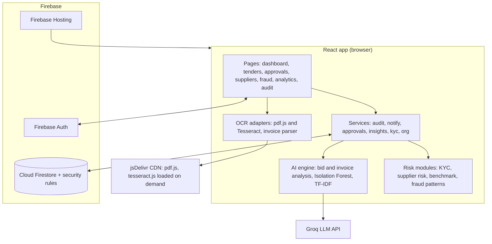
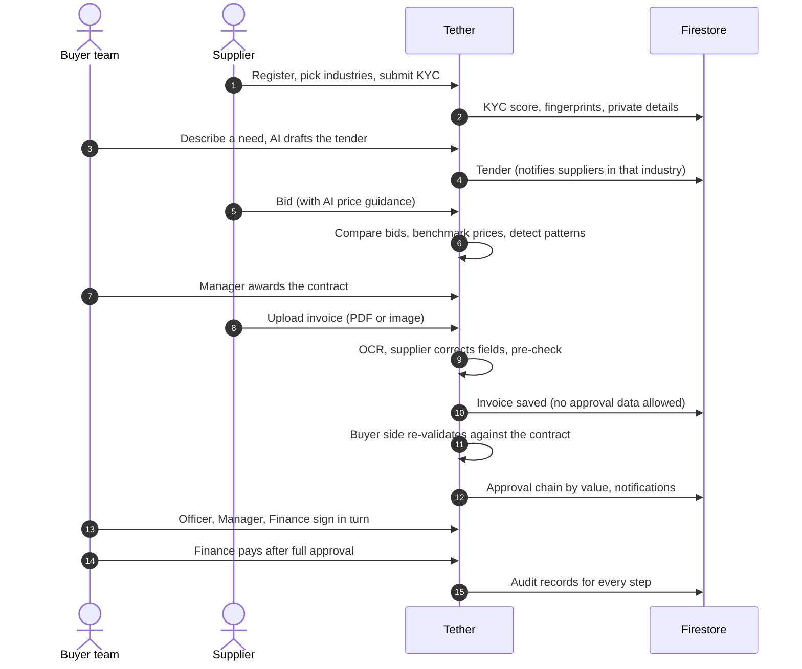
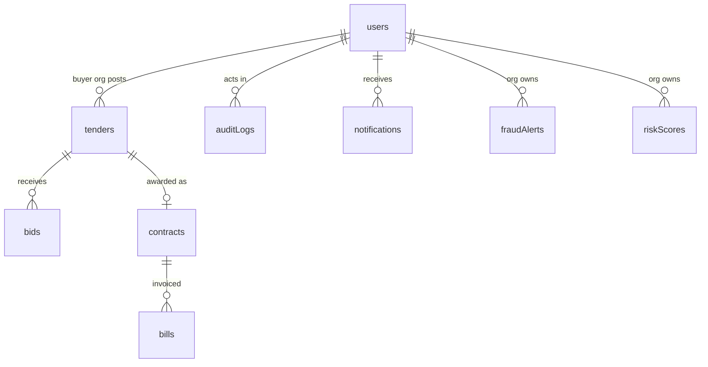
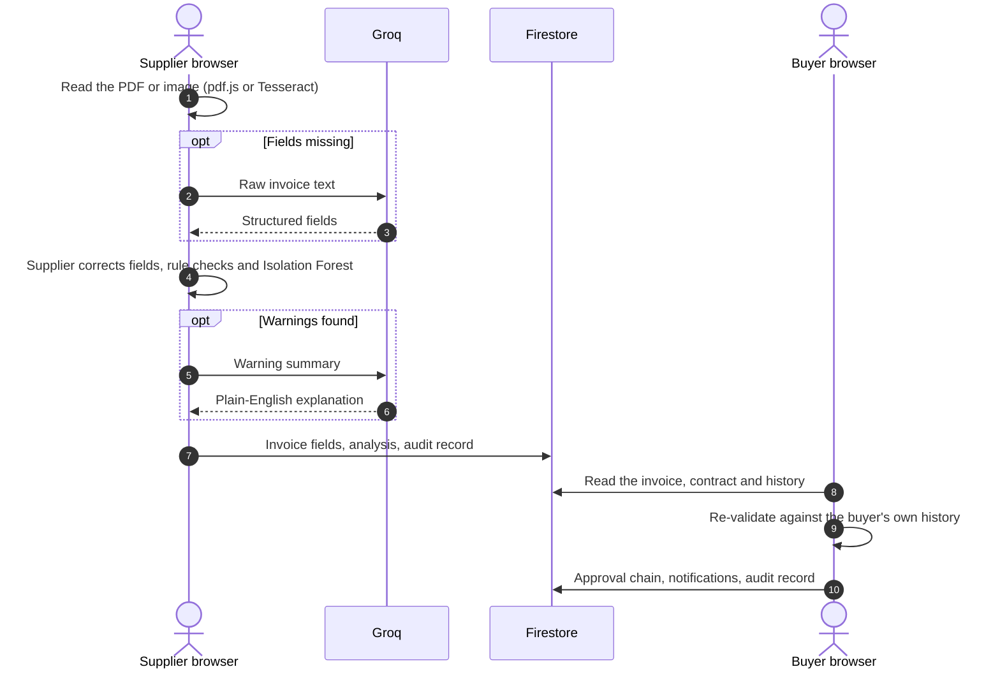

# Tether

**AI-powered secure procurement.**

Tether is an AI-powered secure procurement platform designed to reduce procurement leakage, detect
suspicious supplier behaviour, validate invoices, and provide transparent procurement risk management.

**Live demo:** https://tether-40505.web.app

> Final-year project, Department of Computer Science & Engineering, Amrita School of Computing, Chennai.
> Team: Kanikuntla Vyshnavi (CH.SC.U4AIE23025), Madhumitha K (CH.SC.U4AIE23027), Madhunala Himanshu (CH.SC.U4AIE23028).
> Faculty: Bharati Mohan.

---

## Contents

1. [What is Tether?](#1-what-is-tether)
2. [Core features](#2-core-features)
3. [Architecture](#3-architecture)
4. [Feature flow](#4-feature-flow)
5. [Roles and permissions](#5-roles-and-permissions)
6. [AI / ML components](#6-ai--ml-components)
7. [Scoring logic](#7-scoring-logic)
8. [Database structure](#8-database-structure)
9. [Security](#9-security)
10. [Data storage and what the AI sees](#10-data-storage-and-what-the-ai-sees)
11. [Technology stack](#11-technology-stack)
12. [Installation and running](#12-installation-and-running)
13. [Environment variables](#13-environment-variables)
14. [Testing](#14-testing)
15. [Demo workflow](#15-demo-workflow)
16. [Project structure](#16-project-structure)
17. [Limitations and future work](#17-limitations-and-future-work)

---

## 1. What is Tether?

Organisations lose money in procurement in ways ordinary accounting software misses: duplicate invoices,
prices above the contract, extra charges nobody agreed to, "competing" suppliers that are secretly the same
company, and suppliers linked to someone inside the buyer's organisation. Periodic audits find these
**after** the money has gone.

Tether checks every step **before** money moves:

- Buyers post **tenders**; suppliers in the matching industry **bid**.
- AI compares bids, benchmarks prices against your own history, and flags suspicious bidding.
- The buyer **awards a contract**; the supplier **uploads an invoice** (PDF or image), which is read by OCR.
- The invoice is checked against the contract, then signed off through a **multi-level approval** chain.
- Every action is written to an **append-only audit trail**, and the people who need to act are **notified**.

## 2. Core features

| Feature | What it does | Where |
|---|---|---|
| **Supplier KYC & verification** | GSTIN (with check character), PAN, IFSC, email, phone and completeness checks; duplicate and relationship detection against other suppliers; KYC score 0–100 | Verification, Suppliers → Verification |
| **Supplier risk scoring** | Rule-based 0–100 score from KYC, bidding, invoicing and alerts, with every contributing reason | Suppliers |
| **AI bid analysis** | Value score (price / delivery / risk), 8 checks per bid, copied-proposal and linked-bidder detection, AI proposal review | Tender page |
| **Price benchmarking** | Average, median, min and max from your own past contracts, bids and paid invoices; deviation per bid; refuses to benchmark with fewer than 3 prices | Tender page, Analytics |
| **Invoice OCR** | PDF text extraction or Tesseract OCR for scans and images; field extraction with confidence; manual correction before validation | Contracts → Upload invoice |
| **Contract validation** | Price, quantity, extra charges, GST rate, totals, supplier name, contract reference, duplicate and suspicious invoice numbers | Automatic on every invoice |
| **Fraud pattern detection** | Collusion, invoice-fraud and procurement-anomaly patterns, each explained; dismiss with a reason | Fraud detection |
| **Multi-level approval** | Configurable value thresholds; Officer → Manager → Finance; only the right role may sign; rejection needs a reason | Approvals, Team & settings |
| **Procurement dashboard** | Live KPIs and charts from Firestore | Dashboard |
| **Procurement analytics** | Spend, supplier, tender, invoice and risk analytics with date, supplier, category, risk and status filters | Analytics |
| **Audit trail** | Append-only log of every important action with before/after values and reasons; search and filters | Audit trail |
| **Notifications** | In-app bell and page; role-targeted; severity; read/unread; optional email channel | Bell, Notifications |
| **PDF audit reports** | Procurement, supplier and risk summaries, suspicious activity, invoice anomalies, approval history and every event for a date range | Audit trail → Export audit report |

Also: one global search (Ctrl K) for IDs, invoices, tenders and products; an AI assistant with tools;
AI tender drafting; AI price guidance for suppliers; supplier "play areas" (industries) that decide which tenders they see.

## 3. Architecture

Tether is a React single-page app on Firebase. There is no custom server: business rules run in the
browser **and** are enforced by Firestore security rules, so a modified client still can't skip them.



**Design principle.** Deterministic code makes every decision that blocks money: rules, statistics,
the Isolation Forest, KYC checks and approval thresholds. The language model drafts, explains and
fills gaps, and everything it produces is labelled "AI" and can be checked or overridden.

## 4. Feature flow



## 5. Roles and permissions

A supplier company is its own organisation. A buyer company is an organisation with a team; the person
who registers it is the **admin** and invites colleagues by email (Team & settings).

| | Supplier | Procurement Officer | Procurement Manager | Finance Manager | Admin |
|---|:-:|:-:|:-:|:-:|:-:|
| Bid, upload invoices, complete KYC | ✓ | | | | |
| Create tenders | | ✓ | ✓ | | ✓ |
| Award contracts | | | ✓ | | ✓ |
| Approve invoices | | Officer step | Manager step | Finance step | Any step |
| Pay invoices | | | | ✓ | ✓ |
| View audit trail and export reports | | | ✓ | ✓ | ✓ |
| Dismiss fraud alerts | | | ✓ | ✓ | ✓ |
| Manage team and approval thresholds | | | | | ✓ |

All of this is defined once in `src/security/roles.js` and enforced again in `firestore.rules`.

### How a team member joins

Tether doesn't send invitation emails yet, so the admin tells the colleague directly.

1. The admin opens **Team & settings**, enters the colleague's email and picks a role, then clicks **Invite**.
2. The colleague opens Tether → **Create account** → Account type **"Team member: my company admin invited me"**.
3. They register with **exactly the invited email**. There's no company name to fill in: they join the admin's company with the chosen role.
4. If there's no invitation for that email, sign-up stops and nothing is created, so they can try again once invited.

## 6. AI / ML components

| Component | Type | Used for | File |
|---|---|---|---|
| Rule engine | Deterministic | Contract checks, KYC formats, approvals | `src/ai/engine.js`, `src/risk/kyc.js` |
| Isolation Forest (from scratch, seeded) | Unsupervised ML | How unusual an invoice is versus the buyer's history | `src/ai/ml/isolationForest.js` |
| TF-IDF + cosine similarity | NLP | Copied proposals, duplicate invoice descriptions, address matching | `src/ai/ml/text.js` |
| Robust z-score, coefficient of variation | Statistics | Abnormal bid prices, price-fixing (bids too close together) | `src/ai/ml/stats.js` |
| Entity resolution | Rules + normalisation + SHA-256 fingerprints | Shared bank account, PAN, GSTIN, phone, address, directors, company names | `src/risk/kyc.js` |
| Pattern detection | Rules over engine output | Collusion, invoice fraud, procurement anomalies | `src/risk/fraud.js` |
| Tesseract OCR / pdf.js | OCR | Reading invoice documents | `src/ocr/index.js` |
| Invoice parser | Rules | OCR text to fields, arithmetic consistency | `src/ocr/parseInvoice.js` |
| Groq LLM (`qwen/qwen3.8-27b`) | Generative AI | Tender drafting, term extraction, proposal review, explanations, briefing, filling OCR gaps, assistant | `src/ai/llm.js` |

Every AI result carries an explanation: flags have a structured reason (`{ type, severity, detail, evidence }`),
risk scores list their factors, and alerts list why they were raised. Patterns are described as
"Suspicious pattern detected", never as proof of fraud.

## 7. Scoring logic

### KYC score (max 100)

| Check | Points |
|---|---|
| GSTIN valid (12 for format, 8 more for the check character) | 20 |
| PAN valid (10 if it doesn't match the PAN inside the GSTIN) | 15 |
| IFSC valid | 10 |
| Company email (4 for a free provider such as Gmail, which is a signal, not proof) | 10 |
| Phone valid | 10 |
| Complete profile (proportional) | 10 |
| No duplicate identity (GSTIN, PAN or company name used by another supplier) | 10 |
| No shared bank account | 10 |
| No suspicious relationship (phone, address, directors, company email domain) | 5 |

80–100 **Verified** · 60–79 **Needs review** · 0–59 **High risk**

> Verification confirms the validity and consistency of submitted information. It does not independently
> authenticate government or banking records.

### Supplier risk score (max 100)

| Factor | Points | Cap |
|---|---|---|
| KYC not submitted / needs review / high risk | 15 / 10 / 25 | |
| Shared identity with another supplier (GSTIN, PAN, name) | 20 each | 25 |
| Shared bank account | 20 | 20 |
| Shared phone, address, directors or email domain | 6 each | 12 |
| Abnormal bid pricing | 8 per bid | 16 |
| Linked or copied bids | 12 per bid | 24 |
| Questionable proposals (AI review) | 4 per bid | 8 |
| Contract violations on invoices | 10 per invoice | 25 |
| Duplicate invoices | 10 per invoice | 20 |
| Unusual invoices (Isolation Forest) | 6 per invoice | 12 |
| Rejected invoices | 8 per invoice | 16 |
| Open suspicious-pattern alerts | 10 per alert | 20 |

0–29 **Low** · 30–59 **Medium** · 60–100 **High**

### Bid value score (max 100)

55 × (lowest price ÷ this price) + 20 × (fastest delivery ÷ this delivery) + 25 × (1 − risk ÷ 100).
Bids on hold are never recommended.

### Invoice risk and decision

High flags add 40, medium 20, low 8, plus the anomaly score, capped at 100:
0–24 **clear**, 25–59 **needs review**, 60+ **on hold** (it can't be approved until the AI flags are reviewed).

### Approval thresholds (defaults; admin-configurable)

| Invoice amount | Approvals |
|---|---|
| Up to ₹50,000 | Procurement Officer |
| ₹50,000 – ₹5,00,000 | + Procurement Manager |
| Above ₹5,00,000 | + Finance Manager |

### Price benchmark

From your own past contracts, past bids (other tenders) and paid invoices for the same product.
Fewer than 3 prices: *"Insufficient historical data for reliable benchmarking."* Above the historical
maximum is "Above historical range"; more than 10% over the average is "Higher than usual".

## 8. Database structure

Existing collections were extended; new ones were added only where nothing equivalent existed.



| Collection | Key fields (new fields in **bold**) |
|---|---|
| `users/{uid}` | `role`, `companyName`, **`orgId`**, **`staffRole`**, **`displayName`**, `industries`, **`kyc {status, score, checks, duplicates, identity (fingerprints), masked}`**, `gstin`, `address`, **`directors`** |
| `users/{uid}/private/kyc` | **PAN, bank account, IFSC, phone, email.** Only the owner can read it. |
| `invites/{email}` | **`orgId`, `staffRole`, `status`** |
| `settings/{orgId}` | **`approvals.tiers`** |
| `tenders` | `buyerId` (= org id), `industry`, `status`, `aiAnalysis {bids[] with breakdown and checks}`, **`createdBy`** |
| `bids` | `tenderId`, `buyerId`, `supplierId`, `unitPrice`, `proposal`, `status`, **`tenderTitle`** |
| `contracts` | `buyerId`, `supplierId`, `agreedUnitPrice`, `maxQuantity`, `quantityInvoiced`, `extractedTerms` |
| `bills` (invoices) | `contractId`, `supplierId`, `consumerId` (= buyer org), `amount`, **`invoiceNumber`, `tax`, `source`, `ocr {fields, confidence, corrected}`, `approval {status, tier, steps[], nextRole}`, `validatedBy`, `paidBy`, `rejectReason`** |
| `auditLogs` | **`orgId`, `userId`, `userName`, `userRole`, `action`, `entityType`, `entityId`, `previous`, `next`, `reason`, `createdAt`** |
| `notifications` | **`userId`, `title`, `message`, `severity`, `kind`, `link`, `read`** |
| `fraudAlerts` | **`orgId`, `key`, `category`, `level`, `title`, `reasons`, `status`, `dismissReason`** |
| `riskScores` | **`orgId`, `supplierId`, `score`, `level`, `factors`** |
| `products`, `requests`, `ratings`, `limits` | Direct catalogue buying (unchanged; `consumerId` / `limits` id is now the org id) |

Older accounts are upgraded automatically: a buyer account without `orgId` becomes the admin of its own
organisation on next sign-in, and every unpaid invoice gets an approval chain when a team member is online.

## 9. Security

- **Firestore rules** (`firestore.rules`) enforce roles and organisations server-side:
  - nobody joins an organisation without an invitation for their email
  - members cannot change their own role
  - suppliers cannot read other suppliers' bids, contracts, invoices or private KYC
  - suppliers cannot write validation or approval data on invoices, or edit invoices after sending
  - only the role whose turn it is (or an admin) can sign an approval step
  - payment is possible only after full approval, and only by finance or admin
  - audit logs are create-only with server timestamps, readable only by managers of the organisation, and cannot be updated or deleted by anyone
  - fraud alerts and risk scores are private to the buyer organisation
- **Buyer-side validation.** Each invoice is re-validated by a buyer's browser on arrival, so a supplier cannot submit a forged "clear" result.
- **Sensitive data.** Bank account, PAN and IFSC are stored in an owner-only document. Other users see masked values and SHA-256 fingerprints, used only for duplicate detection.
- **No secrets for email.** The email channel posts to an endpoint you control (`REACT_APP_NOTIFY_WEBHOOK`); no provider keys live in the app.
- The rules are covered by **24 automated tests** on the Firebase emulator (`npm run test:rules`).

**Known limitation:** the Groq key is used from the browser (`REACT_APP_GROQ_API_KEY`), so it is visible
to users of the deployed site. For production, move `src/ai/llm.js` behind a Cloud Function and use a new key.

## 10. Data storage and what the AI sees

Tether stores data in three places and sends data to one outside AI service. This section lists all of it.

### 10.1 Where data lives

| Place | What's there |
|---|---|
| **Firebase Authentication** | Email and password (hashed by Google; Tether never sees it), sign-in session |
| **Cloud Firestore** | All business records (collections in [section 8](#8-database-structure)) |
| **Browser `localStorage`** | Light or dark theme, which help boxes were dismissed |
| **Browser `sessionStorage`** | Cached Home briefing, a one-time "just logged in" flag for the audit log |

**Not stored anywhere:**

- **Uploaded invoice files.** They're read in the browser and discarded; only the extracted fields are saved.
- **Raw OCR text.**
- **Chat assistant conversations.** They live in the open tab and disappear on refresh.

### 10.2 Who can read what in Firestore

| Data | Who can read it |
|---|---|
| Public business profile (`users/{uid}`: company name, role, industries, GSTIN, address, directors, **masked** phone, PAN and bank, KYC score and fingerprints) | Any signed-in user. It's needed for duplicate and relationship detection. |
| Private KYC (`users/{uid}/private/kyc`: **full** PAN, bank account, IFSC, phone, email) | **Only the owner** |
| Tenders | Any signed-in user (suppliers need to find them) |
| Bids, contracts, invoices | The supplier involved, and the buyer organisation's team |
| Audit logs | Managers of the buyer organisation; nobody can edit or delete them |
| Fraud alerts, risk scores, approval settings | The buyer organisation's team |
| Notifications | Only the recipient |
| Invitations | The organisation's admin and the invited person |

A **fingerprint** is a SHA-256 hash of a bank account, PAN, GSTIN or phone number. Two suppliers with the
same bank account produce the same fingerprint, so Tether can flag "these two share a bank account"
without anyone seeing the number.

### 10.3 AI that runs in the browser (nothing leaves the device)

| What | Data used |
|---|---|
| Invoice-versus-contract checks | The invoice and its contract |
| Duplicate invoice detection (TF-IDF) | The buyer's past invoices |
| Isolation Forest anomaly score | Amount, unit price, extra-charge share and quantity of past invoices |
| Bid checks (copied proposals, price outliers, prices suspiciously close together) | The bids on the tender |
| Relationship detection between companies | Fingerprints and public profile fields |
| KYC score, supplier risk, price benchmark, fraud patterns, dashboards | The organisation's own Firestore data |
| **OCR** (pdf.js, Tesseract) | The uploaded file. The libraries are downloaded from jsDelivr, but the file never leaves the browser. |

**Every decision that blocks money is made here**: flags, holds, risk scores and approvals. None of it depends on the language model.

### 10.4 What is sent to Groq

The language model is called directly from the browser (`src/ai/llm.js` and `src/components/ChatAssistant.js`).
Each feature sends only what it needs:

| Feature | Triggered when | Sent to Groq |
|---|---|---|
| Draft tender | Buyer clicks **Draft with AI** | The sentence the buyer typed, plus the product list |
| Contract terms extraction | A contract is awarded | The tender's contract-terms text (up to 6,000 characters) |
| Proposal review | Bids are analysed | Product, quantity, terms; each bid's ID, **supplier name** and **proposal text** (up to 1,500 characters) |
| Bid evaluation summary | Bids are analysed | Tender title, product, max price; **supplier names**, value and risk scores, warning texts |
| Invoice explanation | An invoice has warnings | Contract title, agreed price, max quantity, risk score, decision, estimated leakage, warning texts |
| OCR gap filling | The parser missed some fields | **The invoice's raw text** (up to 6,000 characters), plus up to 120 product names |
| Supplier price guidance | A supplier opens a tender to bid | Tender title, product, quantity, unit, delivery date, terms, the supplier's description |
| Home briefing | The Home page opens | Company name and dashboard counts and totals |
| Catalogue search | Searching the catalogue | The search text, plus product names |
| Chat assistant | Every message | Company name, role, industries, record counts and product names; the user's messages; **short summaries** of tool results (counts, titles, short IDs, totals). The full records are shown to the user but not sent to the model. |

**Never sent to Groq:** full bank account, PAN, IFSC or phone numbers from KYC; passwords; fingerprints;
audit logs; invoice files.

**One exception to watch:** OCR gap filling sends the invoice's raw text. If the invoice itself prints bank
details or a GSTIN, that text reaches Groq. This only happens when the parser could not find every field.

Without `REACT_APP_GROQ_API_KEY`, every check still runs; only the drafting, the explanations and the assistant fall back to rule-based text.

### 10.5 One invoice, end to end



### 10.6 Privacy risks before a real launch

- **The Groq key is visible** in the browser bundle. Move `src/ai/llm.js` behind a Cloud Function and rotate the key.
- **Groq receives business text** (supplier names, proposals, sometimes invoice text). Check Groq's data-retention terms and tell users.
- **Security rules must be deployed** (`firebase deploy --only firestore:rules`); until then the live project runs on its previous rules.

## 11. Technology stack

| Layer | Technology |
|---|---|
| Frontend | React 19, React Router 7, lucide-react icons, plain CSS design system (light and dark) |
| Data and auth | Firebase Authentication, Cloud Firestore, security rules |
| Hosting | Firebase Hosting |
| AI | Groq API (OpenAI-compatible), in-browser ML (Isolation Forest, TF-IDF, statistics) |
| OCR | pdf.js 4.4 and Tesseract.js 5.1, loaded from jsDelivr only when an invoice is uploaded |
| Charts | Dependency-free React and CSS charts |
| PDF reports | Printable HTML and the browser's "Save as PDF" |
| Testing | Jest (CRA), Firebase Local Emulator Suite |

No new npm dependencies were added for these features.

## 12. Installation and running

**Requirements:** Node.js 18+, and for the emulator tests Java 21+ and `firebase-tools` (`npm i -g firebase-tools`).

```bash
git clone https://github.com/himanshu2005-tech/tether.git
cd tether
npm install
```

Create `.env` (git-ignored):

```
REACT_APP_GROQ_API_KEY=your_groq_key
```

```bash
npm start            # http://localhost:3000, using your Firebase project
```

**Run everything locally without touching production:**

```bash
npm run emulators                                   # terminal 1: local Auth + Firestore
# terminal 2 (PowerShell):  $env:REACT_APP_USE_EMULATORS="true"; npm start
# terminal 2 (bash):        REACT_APP_USE_EMULATORS=true npm start
```

**Deploy:**

```bash
npm run build
firebase deploy --only hosting
firebase deploy --only firestore:rules    # the new rules: deploy them for the security to apply
```

## 13. Environment variables

| Variable | Required | Purpose |
|---|---|---|
| `REACT_APP_GROQ_API_KEY` | For AI text features | Groq API key. Without it every check still runs; drafting, explanations and the assistant fall back to rules. |
| `REACT_APP_GROQ_MODEL` | No | Override the model (default `qwen/qwen3.8-27b`) |
| `REACT_APP_USE_EMULATORS` | No | `true` connects to the local Firebase emulators (demo project) |
| `REACT_APP_NOTIFY_WEBHOOK` | No | Your server endpoint that sends notification emails. Unset means in-app only. |

Firebase web config lives in `src/firebase.js`. It is not secret; access is controlled by the security rules.

## 14. Testing

```bash
npm run test:ai      # 44 unit tests: engine, KYC, risk, benchmark, fraud, approvals, OCR parsing
npm run test:rules   # 35 emulator tests: 24 security-rule tests + 11-step end-to-end workflow
```

The end-to-end test (`src/integration/workflow.test.js`) runs the real services against the emulator:
team invitations → supplier KYC (with a shared bank account caught) → tender → bids → AI comparison
(copied and linked bids flagged) → award → OCR-parsed invoice → buyer-side validation → unauthorised
approval refused → approval → payment → rejection with reason → supplier risk scores and fraud alerts →
audit records for every step → role-targeted notifications → audit report contents and date filter.

## 15. Demo workflow

To explore locally with data: start the emulators, then seed the demo organisation with
`SEED_RUN=demo` plus the emulator variables and `react-scripts test --runInBand src/integration/workflow`.
Then sign in with password `password123` as:
`admin-demo@buyerco.example` (admin), `officer-demo@buyerco.example`, `manager-demo@buyerco.example`,
`finance-demo@buyerco.example`, or the suppliers `gamma-demo@gamma.example`, `alpha-demo@alpha.example`,
`beta-demo@beta.example`. **This is demo data in the local emulator only.**

The full story in the app:

1. **Buyer** registers (becomes admin) and invites a procurement officer, manager and finance manager in **Team & settings**. They sign up as **Team member** with the invited email ([how](#how-a-team-member-joins)).
2. **Suppliers** register, choose their industries, and complete **Verification**. A supplier reusing another's bank account is flagged.
3. The officer creates a **tender** by describing it in one sentence ("Draft with AI").
4. Suppliers in that industry are notified and **bid**, with AI price guidance.
5. On the tender page the buyer sees the **AI bid evaluation**: value-score breakdown, 8 checks per bid, the **price benchmark**, and copied or linked bids flagged.
6. The **manager** awards the contract.
7. The supplier **uploads an invoice** (PDF or photo). OCR extracts the fields with a confidence score; the supplier corrects anything wrong, validates and submits.
8. A buyer's browser **re-validates** it against the contract and starts the **approval chain** for its value.
9. Approvers are **notified** and sign in **Approvals**. A wrong role is refused; rejection needs a reason.
10. **Finance** pays after full approval.
11. **Suppliers**, **Fraud detection**, the **Dashboard** and **Analytics** update from live data.
12. A manager opens the **Audit trail** and **exports the audit report** as a PDF for any date range.

## 16. Project structure

```
src/
├── ai/            engine.js (bid and invoice analysis), llm.js (Groq), ml/ (Isolation Forest, TF-IDF, stats)
├── risk/          kyc.js, supplierRisk.js, benchmark.js, fraud.js (+ tests)
├── ocr/           index.js (pdf.js / Tesseract adapters), parseInvoice.js
├── services/      audit, notify, approvals, useInvoiceIntake, insights, metrics, orgData, org, kyc, report
├── security/      roles.js (roles and permissions)
├── constants/     approvals.js (thresholds), products.js (industries), glossary.js
├── components/    pages and shared UI (Guide.js: badges, dialogs, InfoTip; Charts.js)
├── integration/   emulator tests: rules.test.js, workflow.test.js
├── context/       AuthContext (user, org, role), ThemeContext
└── firebase.js    Firebase app (+ emulator switch)
firestore.rules    security rules
firebase.json      hosting, rules and emulator configuration
```

## 17. Limitations and future work

- **Groq key in the browser.** Move LLM calls to a Cloud Function before a real launch.
- **Client-side business logic.** Validation, scoring and notifications run in users' browsers; the security rules prevent the dangerous writes, but a Cloud Function would make intake independent of a buyer being online.
- **Invoice files are not stored.** Only the extracted fields are kept, because Cloud Storage needs the Firebase Blaze plan.
- **OCR quality** depends on scan quality. Tesseract handles printed English invoices; handwriting and complex tables need a commercial OCR provider, which can replace the adapter in `src/ocr/index.js`.
- **Fingerprints** hide numbers from casual viewing but short numbers can be brute-forced; server-side matching would remove that.
- **KYC** is format and consistency checking only, not government or bank verification.
- **Late-delivery risk** is not scored yet because delivery confirmation is not recorded.
- **Future:** graph database for multi-hop relationships, learning risk weights from reviewed outcomes, contract PDF upload.

---

Built with React, Firebase and Groq.
